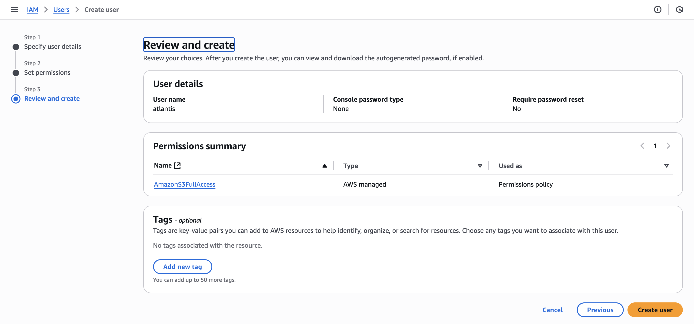
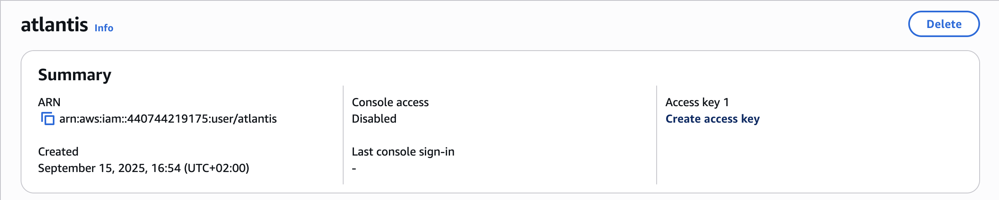
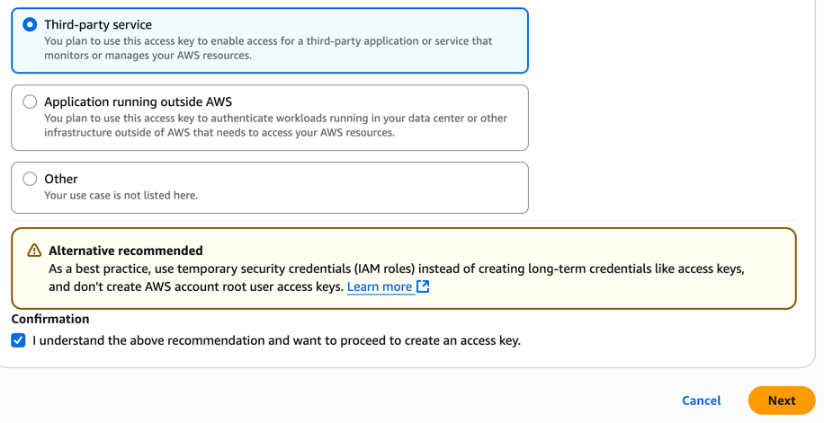

+++
date = '2025-09-04T13:40:42+02:00'
draft = true
title = 'Automatizando Terraform com GitOps: Um guia para iniciantes com Atlantis'
+++

Embora muitos de nós já tenhamos nos livrado de rodar `terraform apply` localmente, infelizmente outros ainda não encontraram uma forma de se livrar desse carma. Seja por falta de conhecimento ("às vezes o indivíduo está nas drogas"), seja por restrições de orçamento (Terraform Cloud custa algo em torno de $0.10USD/recurso gerenciado 🤑). Qualquer que seja desses problemas, vou tentar te ajudar a resolver isso e sair dessa vida miserável 😅.  

A forma mais simples e barata que vou te apresentar é usando o [Atlantis](https://www.runatlantis.io/).

> Atlantis é uma ferramenta para colaboração entre colegas de time[...]  
> A principal funcionalidade do Atlantis é permitir/possibilitar que desenvolvedores  
> possam executar `plan` e `apply` diretamente do Pull/Merge Request.  
> Assim dando visibilidade e controle sobre a infraestrutura como código.  
> Link para o post [aqui](https://www.runatlantis.io/blog/2017/introducing-atlantis.html)  

## TL;DR ⚡️
- O que é o Atlantis? Uma ferramenta de automação GitOps para Terraform que permite rodar plan e apply diretamente nos seus Pull Requests (PRs), centralizando a colaboração e o histórico de mudanças do código de infraestrutura.

- Instalação Fácil: vou mostrar como subir uma instância do Atlantis em minutos com um simples arquivo `docker-compose.yml` e como configurá-lo para se conectar ao seu repositório no GitHub via webhook.

- Workflow Padrão: Ao abrir um PR, o Atlantis automaticamente executa um `terraform plan` e posta o resultado como um comentário. Após a aprovação, basta comentar `atlantis apply` para aplicar as mudanças. Tudo dentro do seu PR <mind blowing GIF here>!

- Workflows Customizados: Aprenda a usar o arquivo `atlantis.yaml` para criar pipelines personalizados, adicionando etapas extras como a execução de _scripts_ de validação, testes ou ferramentas de segurança.

- Integração com Infracost: um extra sugerido pelo Vinicius Casellato lá no Linkedinho! Integramos o Infracost ao workflow customizado para que, com o plan, o Atlantis também comente no PR uma estimativa detalhada de custos daquela mudança 🤩.

- Resultado: Tenha total visibilidade do impacto técnico e financeiro das suas alterações antes do apply, evitando surpresas na fatura e promovendo maior visibilidade e controle por parte da equipe de Infrastrutura nos seus ambientes de dev/produção.

## O que é o Atlantis? 🏝️
Atlantis brilha em cenários com muitos devs/devops/platform engineers trabalhando sobre a mesma base de código e com um volume de mudanças onde os colaboradores acabam "pisando" nos dedos uns dos outros, ou seja, num ambiente dinâmico de qualquer empresa minimamente estruturada nos dias de Cloud, é essa a realidade.

Soluções comuns são pipelines de CI/CD como Gitlab ou Github Actions, que geralmente não são baratos em casos de times um pouco maiores. Gitlab custa algo em torno de 29 trumps por dev no time no plano mais básico e o GitHub vai custar algo em torno de 21 trumps por dev. Sim, eu sei que ambos têm free tier, mas geralmente é bem capenga e capado, ou seja, poucos minutos de CI/CD e faltando features essenciais. Se você está em um time onde há alguma ferramenta de CI/CD já implementada, acredito que esse post será mais instrutivo do que prático do ponto de vista de mudar a ferramenta de CD de IaC -- não faz sentido mudar para o Atlantis se seu time já tem uma solução pronta e em uso.

Bom, vamos ao que interessa, "Atlantis ao resgate!"

## Instalação do Atlantis
Para manter simples (ou pelo menos o mais simples possível) todo esse artigo, vou adotar o Docker compose juntamente com o [zrok](https://zrok.io) para rodar o serviço localmente. E vou usar o GitHub para servir de repositório para o nosso código Terraform.  

Então aqui vai uma listinha do que precisamos ter para fazer acontecer: 
1. Conta na [AWS](https://aws.amazon.com/pt/getting-started/guides/setup-environment/module-one/)
2. Conta no [GitHub](https://docs.github.com/pt/get-started/start-your-journey/creating-an-account-on-github)
3. Conta no [zrok](https://docs.zrok.io/docs/getting-started/) 
4. ter o [cli do zrok](https://docs.zrok.io/docs/guides/install/) instalado na sua máquina
5. Docker Compose parte do Docker, basta instalar: `curl -fsSL get.docker.com | sh -` e tá pronto. Para Windows, dá seus pulos 😜.


### Obtendo as credenciais da AWS

Vou usar AWS nesse exemplo só porque é simples de começar e a free tier é bem generosa. Se você tem familiaridade com outro provedor de Cloud, pode seguir com ele.

Faça login na sua conta da AWS, vá em **IAM** e crie um novo usuário, dê o nome de `atlantis`. Para as permissões, selecione apenas o que você quer que este usuário tenha de permissões, no nosso caso eu selecionei S3 Full Access, visto que o exemplo será bem simples e só vamos criar um bucket no S3. 
Agora volte ao IAM, clique em User, clique no usuário que acabamos de criar e crie uma Access Key: 

Selecione o tipo _Third-party service_, marque o checkbox de confirmação e clique Next. Será apresentado a ACCESS KEY e a SECRET KEY, salve esses dados pois você não poderá vê-los novamente.

> ⚠️ IMPORTANTE ⚠️: de posse dessas credenciais, qualquer pessoa pode criar recursos, apagar recursos, editar recursos e tudo o mais na sua conta. Guarde essa informação como um segredo/senha.
### Token do GitHub

Próximo passo é obter um token para acessar nossos repositórios no GitHub. Há duas formas de se obter um token para o GitHub: 1) Personal Access Token ou 2) App Token. Vou optar pela opcão número 1 visto a simplicidade, mas o indicado para workloads de produção seria usar um App Token. [Aqui está a documentação do Atlantis para fazê-lo funcionar com o App token](https://www.runatlantis.io/docs/access-credentials.html#github-app).

Vamos clicar na nossa foto de perfil após fazer login no GitHub e ir em **Settings**. No menu lateral esquerdo, role até o final e clique em **Developer Settings**. Na nova página que carrega, clique em **Personal access tokens** e selecione **Tokens (classic)**, agora clique em **Generate new token** e **Generate new token (classic)** -- pode ser que o GitHub peça pra você autenticar novamente.

Vamos dar um "nome" a esse token usando o campo **Note**. Certifique-se de selecionar uma data de expiração (tokens sem data de expiração são tão perigosos quanto chave debaixo do tapete da porta), selecione **repo** no escopo do token e clique em **Generate token**.

> ⚠️ IMPORTANTE ⚠️: guarde esse token como uma senha/segredo pois ele tem acesso irrestrito ao nosso GitHub.

### ZROK
Como o serviço do Atlantis estará rodando localmente na nossa máquina, precisamos de um forma para expor ele à internet para o webhook do GitHub ser capaz de "avisar" o Atlantis que ele precisa trabalhar. É aí que entra o `zrok`.  

Para o zrok poder expor o Atlantis, precisamos habilitar nosso ambiente (nossa máquina), para isso, siga os passos [aqui](https://docs.zrok.io/docs/getting-started/#enabling-your-zrok-environment). Após habilitar o ambiente, precisamos reservar um endereço público, para isso execute o seguinte commando:
```bash
zrok reserve public --unique-name "atlantis" atlantis:4141
```
O zrok vai te dar uma URL publica, copie o valor para usarmos no arquivo do docker compose.
```terminaloutput
[   3.519]    INFO main.(*reserveCommand).run: your reserved share token is 'atlantis'
[   3.519]    INFO main.(*reserveCommand).run: reserved frontend endpoint: https://atlantis.share.zrok.io
```

### Docker Compose
Agora vamos para o Docker Compose (se você não tem ideia do que é o Docker compose, então dê uma lida nesse artigo [aqui](https://livro.descomplicandodocker.com.br/chapters/chapter_15.html) e/ou [aqui](https://www.datacamp.com/pt/tutorial/docker-compose-guide)). 

Precisamos de um arquivo `docker-compose.yml` contendo tanto o Atlantis quanto o zrok, dessa forma teremos o que é necessário para executar o Atlantis e expô-lo à internet para que o GitHub possa acessar o endpoint de eventos do Atlantis -- é assim que ele vai saber que é hora de rodar o plan e apply.  

```
Agora crie o arquivo docker-compose.yaml com o seguinte conteúdo:

```yaml
services:
  zrok:
    image: openziti/zrok
    restart: unless-stopped
    user: "${UID}"
    volumes:
      - ${HOME}/.zrok:/home/ziggy/.zrok
    environment:
      PFXLOG_NO_JSON: "true"
    command: share reserved "atlantis" --headless
    
  atlantis:
    image: ghcr.io/runatlantis/atlantis:latest
    user: atlantis
    environment:
      ATLANTIS_ATLANTIS_URL: "https://atlantis.share.zrok.io"
      ATLANTIS_GH_TOKEN: "<Atlantis GH token>"
      ATLANTIS_GH_USER:	"ricardosilva86"
      ATLANTIS_GH_WEBHOOK_SECRET: "<webhook secret>"
      ATLANTIS_REPO_ALLOWLIST: "*"
      ATLANTIS_EMOJI_REACTION: "eyes"
      ATLANTIS_REPO_CONFIG: "/home/atlantis/repos.yaml"
      AWS_ACCESS_KEY_ID: "<AWS access key>"
      AWS_SECRET_ACCESS_KEY: "<AWS secret key>"
      AWS_REGION: "eu-central-1"
      ATLANTIS_AUTOMERGE: true
    ports:
      - 4141:4141
    volumes:
      - type: bind
        source: ${HOME}/.atlantis
        target: /home/atlantis
```
Obviamente precisamos substituir os valores importantes aqui pelos nossos próprios:
- `ATLANTIS_ATLANTIS_URL`: aquela URL que o zrok nos deu logo após a criação do ambiente
- `ATLANTIS_GH_TOKEN`: precisamos de um Token para o Atlantis poder autenticar no GitHub
- `ATLANTIS_GH_WEBHOOK_SECRET`: gere um número aleatório usando o [random.org](https://random.org), não use caracteres especiais, apenas `[a-z] [A-Z] [0-9]` com 32 caracteres.
- `ATLANTIS_REPO_ALLOWLIST`: a URL do nosso repositório do GitHub, veja [aqui](https://www.runatlantis.io/docs/server-configuration.html#repo-allowlist) como é o formato dessa URL
- `ATLANTIS_REPO_CONFIG`: onde vamos encontrar o arquivo de configuração do Atlantis no lado do servidor
- `ATLANTIS_EMOJI_REACTION`: o nome do emoji que o Atlantis irá reagir quando perceber o comentário `atlantis plan/apply` no seu MR/PR.
- `AWS_ACCESS_KEY_ID`: aqui vai a key ID da AWS para o usuário `atlantis` que criamos no primeiro passo.
- `AWS_SECRET_ACCESS_KEY`: obviamente aqui vai o secret key.

> 🚀 "Ora, ora, não se irrite", eu sei que você quer rodar um `docker compose up`, mas ainda precisamos cuidar de mais alguns detalhes, mas primeiro, vamos recapitular o que foi feito até agora.

#### Explicando o que fizemos até aqui:
1. Criamos um usuário na AWS, atrelamos uma _policy_ para esse usuário poder realizar as ações que precisamos, no nosso exemplo aqui, só teremos acesso ao S3. Criamos também a Access Key e guardamos as credenciais de forma segura -- eu salvei no meu 1Password ;)
2. Também criamos o nosso **Personal access token** no GitHub para que o Atlantis possa acessar o repositório contendo o código Terraform que ele irá automatizar.
3. Instalamos e habilitamos o `zrok` para podermos expor o Atlantis à internet.
4. Criamos o nosso arquivo do `docker-compose.yaml` para poder subir o serviço do Atlantis.

Até esse ponto temos quase tudo no lugar, agora só precisamos de mais alguns detalhes. 

> "Sigam-me os bons". 

## Configurando o Atlantis

### Código Terraform que vamos automatizar
Criei um repositório no GitHub para poder demonstrar o que vamos fazer. Basicamente temos o seguinte código:

```hcl
# main.tf
resource "aws_s3_bucket" "balde-de-lixo" {
  bucket = var.nome_do_balde
  tags   = var.tags
}

```

```hcl
# backend.tf
terraform {
  backend "s3" {
    bucket = "atlantis-tfstate-files"
    key    = "atlantis-intro/terraform.tfstate"
    region = "eu-central-1"
  }
}
```

```hcl
# providers.tf
terraform {
  required_providers {
    aws = {
      source  = "hashicorp/aws"
      version = "~> 6.0"
    }
  }
}

provider "aws" {
  region = "eu-central-1"
}
```

```hcl
# outputs.tf
output "domain_name" {
  value = aws_s3_bucket.balde-de-lixo.bucket_domain_name
}
```

```hcl
# variables.tf
variable "nome_do_balde" {
  type = string
}

variable "tags" {
  type = map(string)
}
```

```hcl
# terraform.tfvars
nome_do_balde = "balde-de-lixo-do-plancton"
tags = {
  Env  = "dev"
  Team = "Infra"
}
```

Código bem simples para criar um bucket no S3, usando outro bucket como backend para o nosso estado.

Agora temos 2 passos importantes para configurar o Atlantis: 1. o arquivo de configuração do Atlantis e 2. o webhook do GitHub para chamar o Atlantis.

### O Arquivo de configuração do Atlantis

No `docker-compose.yml` nós criamos logo acima, montamos um volume: o nosso home que aponta para um diretório escondido chamado `.atlantis`. Caso você ainda não tenha criado esse diretório, agora é o momento.

Logo após criar esse diretório, crie o arquivo chamado `repos.yaml` dentro do recem criado diretório.

```yaml
# uma lista de configuração de repositórios
repos:
- id: /.*/
  branch: /.*/
  plan_requirements: [mergeable, undiverged]
  apply_requirements: [mergeable, undiverged]
  import_requirements: [mergeable, undiverged]
  allowed_overrides: [apply_requirements, workflow, delete_source_branch_on_merge, repo_locking, repo_locks, custom_policy_check, import_requirements, plan_requirements, silence_pr_comments]
  # allowed_workflows: [development,production] ≤- vamos usar essas configurações depois
  # allow_custom_workflows: true ≤- vamos usar essas configurações depois
  repo_locking: true
  repo_locks:
    mode: on_plan
  custom_policy_check: false
  policy_check: false
  autodiscover:
    mode: auto

- id: github.com/ricardosilva86/atlantis-intro-tf
- id: github.com/ricardosilva86/outro-repositorio
- id: github.com/ricardosilva86/outro-outro-repositorio
```

> Tem inúmeras formas de configurar seus repositórios, caso precise de algo a mais, tente a documentação oficial, que é ótima, [aqui](https://www.runatlantis.io/docs/server-side-repo-config.html).

Basicamente aqui eu setei uma configuração global com `id: /.*/`. Todos os repositórios herdam essa configuração e caso você queira mudar algo, basta adicionar a mudança para o repositório específico.

#### Criando o webhook no GitHub

Agora vamos para a última parte desse setup, criar o webhook no nosso repositório do GitHub. 

Acesse o seu repositório no GitHub e vá em **Settings**, no menu lateral clique em **Webhook**. Em **Payload URL** entre com a URL que o `zrok` nos forneceu e adicione `/events`, no **Content type**, selecione `application/json` e entre com o mesmo segredo que geramos para a variável `ATLANTIS_GH_WEBHOOK_SECRET` na primeira parte. Agora vamos escolher que eventos vão acionar o webhook, selecione **Let me select individual events.** e então marque as opções: **Pull request reviews**, **Pull requests**, **Pushes** e **Issue comments**. Certifique-se que o checkbox de **Active** está marcado e clique em **Add webhook**.
> Lembra lá no começo que tínhamos como criar 2 tipos diferentes de token, um **Personal access token** e o **App token**? Se você optar por um **App token**, o webhook é criado automaticamente. Veja a documentação [aqui](https://www.runatlantis.io/docs/configuring-webhooks.html#github-github-enterprise).
> Também é possível instalar o webhook a nível de organização, o que agiliza o processo de configuração desses webhooks, mas também é necessário desabilitar para repositórios que não são código de infraestrutura.

Finalmente, vamos colocar essa joça pra rodar! Mas primeiro, vamos recapitular o que fizemos até aqui:

> "Ora, ora não se irrite... 🤷‍♂️"

#### Explicando o que fizemos até aqui pt.2:
1. Criamos um repositório no GitHub e criamos um código bem elementar de Terraform;
2. Criamos o diretório local que será montado no container do Atlantis, e dentro desse diretório criamos o `repos.yaml`. Então colocamos o conteúdo do arquivo de configuração para o Atlantis.
3. Criamos o webhook que vai fazer a chamada para o Atlantis executar o _workflow_: em outras palavras, o `plan` e `apply` do lado do servidor.

Pow, finalmente é hora de do show down!

```shell
docker compose up -d
```

```terminaloutput
WARN[0000] The "UID" variable is not set. Defaulting to a blank string. 
[+] Running 24/24
 ✔ zrok Pulled                                                                                                                                                                    19.3s 
   ✔ 7b061f511294 Pull complete                                                                                                                                                   10.5s 
   ✔ 3d6607d3dbc4 Pull complete                                                                                                                                                   10.5s 
   ✔ 6cff76b535d3 Pull complete                                                                                                                                                   13.1s 
   ✔ b3d72ae26f8f Pull complete                                                                                                                                                   13.5s 
   ✔ d5b4f1acfb29 Pull complete                                                                                                                                                   13.5s 
   ✔ 77b5f4970fe8 Pull complete                                                                                                                                                   13.5s 
   ✔ 9e3046e1ce9b Pull complete                                                                                                                                                   13.5s 
   ✔ 4f4fb700ef54 Pull complete                                                                                                                                                   13.9s 
   ✔ b9529084985f Pull complete                                                                                                                                                   16.4s 
   ✔ c30168d90002 Pull complete                                                                                                                                                   16.4s 
   ✔ eac112e77b9c Pull complete                                                                                                                                                   16.5s 
   ✔ 95c29cd56481 Pull complete                                                                                                                                                   16.5s 
   ✔ cd012eabab7e Pull complete                                                                                                                                                   17.5s 
 ✔ atlantis Pulled                                                                                                                                                                16.7s 
   ✔ 6e771e15690e Pull complete                                                                                                                                                    6.5s 
   ✔ 305ced8d2b86 Pull complete                                                                                                                                                    6.5s 
   ✔ fc5cd065b9fe Pull complete                                                                                                                                                    6.9s 
   ✔ e9bfac012337 Pull complete                                                                                                                                                   10.5s 
   ✔ 2bea7a2ea3a3 Pull complete                                                                                                                                                   12.1s 
   ✔ d47b004927cf Pull complete                                                                                                                                                   12.6s 
   ✔ 2d95b90dee76 Pull complete                                                                                                                                                   12.9s 
   ✔ 5032dfc784ba Pull complete                                                                                                                                                   12.9s 
   ✔ b6b31555fe60 Pull complete                                                                                                                                                   15.3s 
[+] Running 3/3
 ✔ Network atlantis-intro_default       Created                                                                                                                                    0.1s 
 ✔ Container atlantis-intro-zrok-1      Started                                                                                                                                    1.7s 
 ✔ Container atlantis-intro-atlantis-1  Started                                                                                                                                    1.7s 
```

